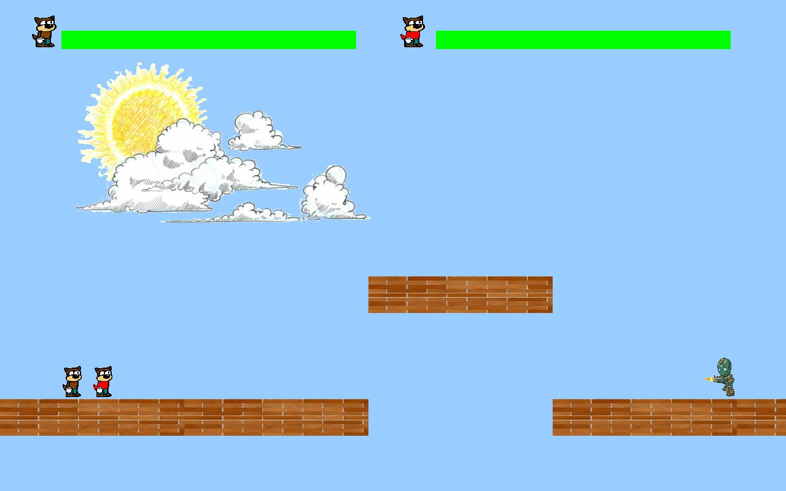
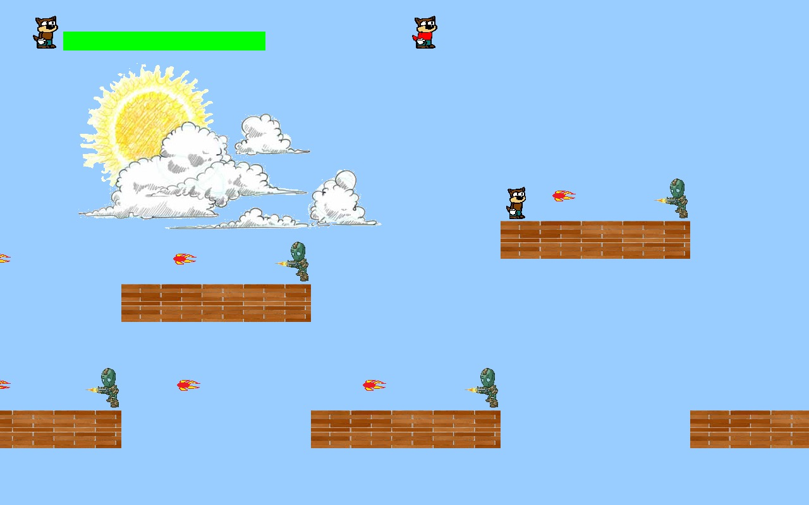
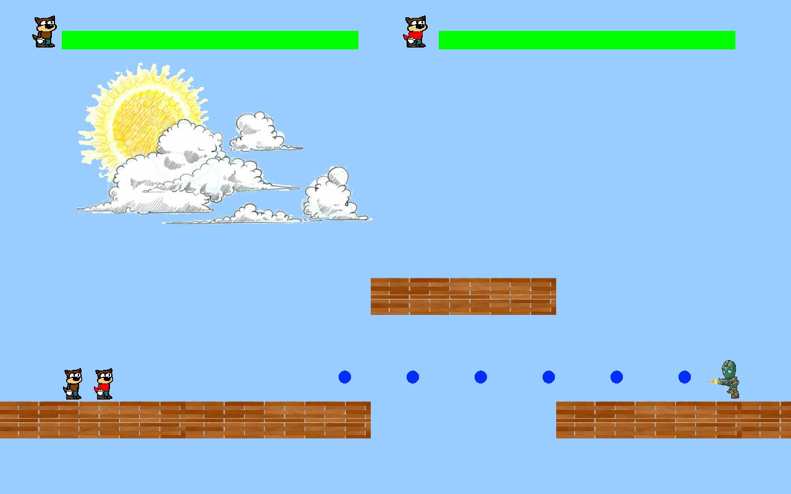

# 2D game in C using SDL library

> A simple two player adventure game developed for knowledge gaining purposes.

DISCLAIMER: The coding standards in this version of the game is very poor as it was developed long back. Kindly wait for the updated version which i am working on.

## Index
  * [Technology Colophon](#colophon)
  * [Screenshots](#screenshots)
  * [Contribute](#contribute)
  * [License](#license)

## Technology Colophon 
  * C language
  * SDL library

## Screenshots 
  * Game start
    
  * Mid game
    
  * Shooting capabilities
    

## Contribute 
  You are always welcome to open an issue or provide a pull-request!

## License 
  Built under [MIT](http://www.opensource.org/licenses/mit-license.php) license.